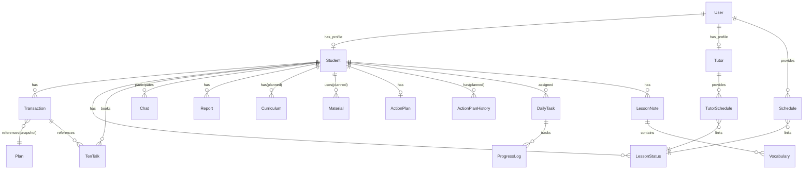
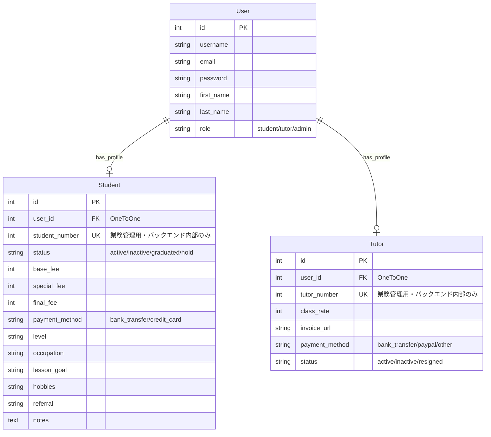
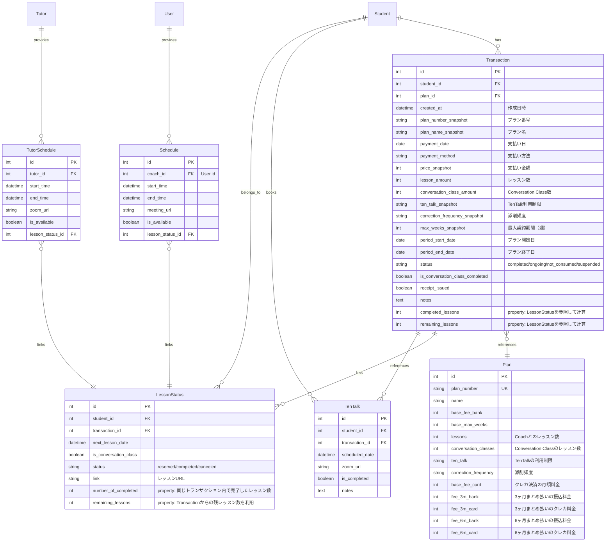
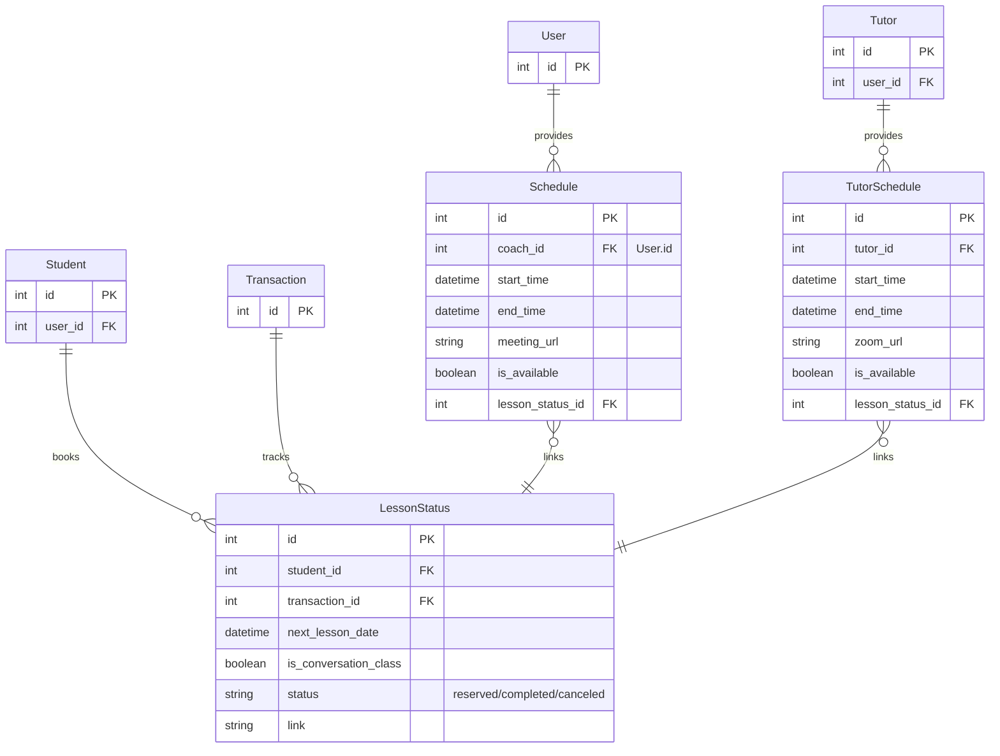
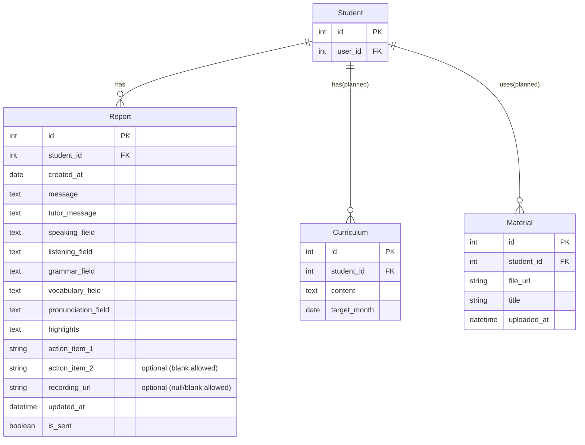
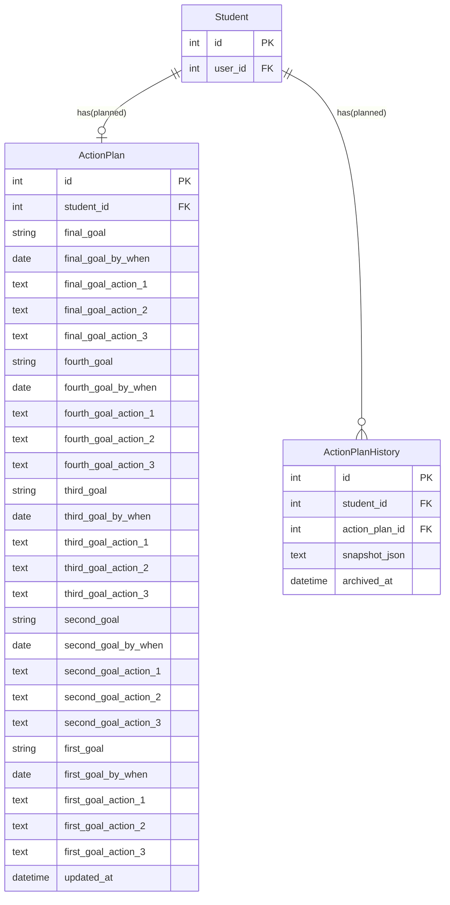
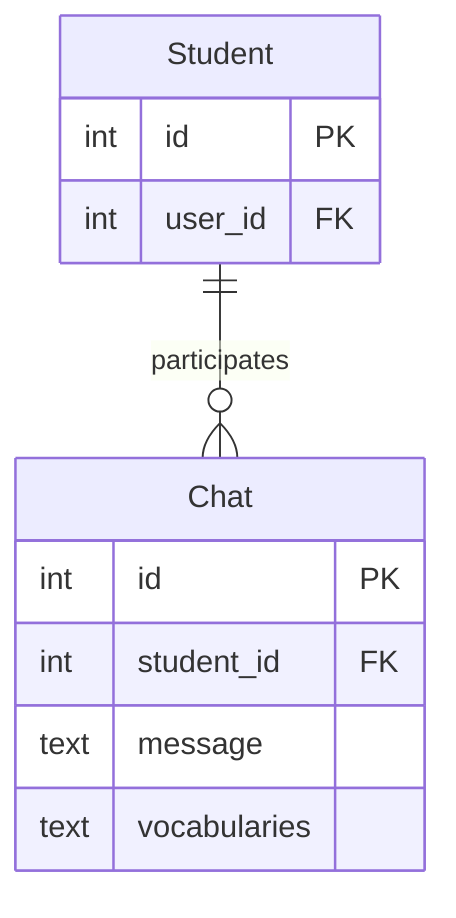
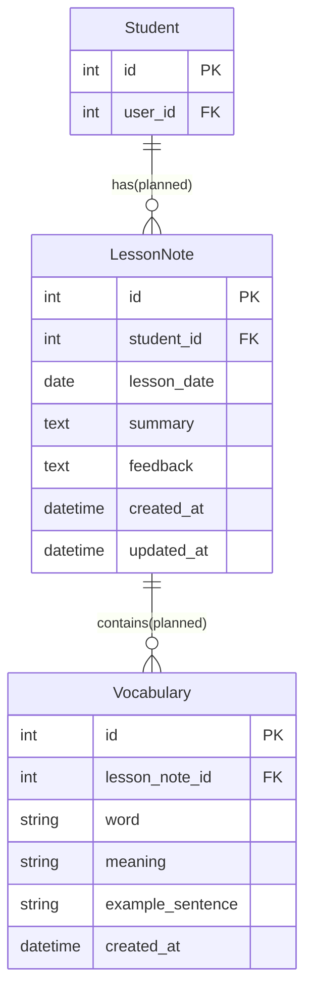
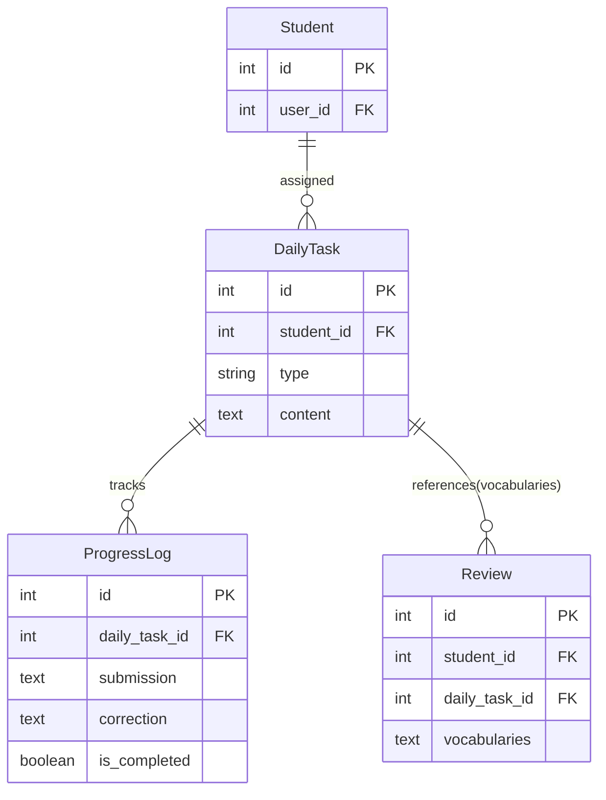

## 🗄️ データベース設計（概要）

### DB確認方法（SQLite / Django）

DBファイルは backend/db.sqlite3（開発段階）

1. SQLiteで直接確認

```bash
cd /Users/saaka/Projects/korup/backend
sqlite3 db.sqlite3
```

2. 接続先とテーブル一覧

```sql
.databases
.tables
```

3. メタ情報（定義・列・外部キー・インデックス）

```sql
.schema account_student
PRAGMA table_info('account_student');
PRAGMA foreign_key_list('trajectory_report');
PRAGMA index_list('account_student');
```

4. 実データ確認（idとFKの対応）

```sql
SELECT id, user_id, student_number, status FROM account_student ORDER BY id DESC LIMIT 20;

SELECT id, student_id, created_at, is_sent FROM trajectory_report ORDER BY id DESC LIMIT 20;

```

5. 終了

```sql
.quit
```

補足: ForeignKeyやOneToOneFieldは、DB上では field_name_id という列名で保存される（例: student_id, user_id）。

### 主要テーブル

#### Accountアプリ（ユーザー管理）
- User
- Student（Userと1対1で紐付け）
- Tutor（Userと1対1で紐付け）

**設計方針**: name/emailはUserモデルに集約し、Student/Tutorは業務データのみを保持。バックエンドはCookieのJWTからrequest.userを特定し、request.user.student_profile / request.user.tutor_profileでアクセスする。student_number / tutor_numberはフロントに渡さない（フロントがURLクエリで番号を持つとCookieによる認証の意味が薄れるため）。


#### Bookingアプリ（予約管理）
- Plan（Studentモデルと紐付け。Planに生徒の情報はない）
- Transaction（生徒のプラン購入情報の大元。Planから参照してsnapshotとして保存することで、Planを変更しても過去の取引情報が保持される）
- LessonStatus（クライアント側向けデータ。Studentのstatusが"graduated"または"hold"の場合は残レッスン数を非表示とする仕様）
- Schedule（コーチ側の予約可能スロット。予約が入るとLessonStatusを追加、または更新。）
- TutorSchedule（Conversation Classの予約可能スロット。予約が入るとLessonStatusを追加、または更新。）
- TenTalk（TenTalkの予約情報。生徒と紐付け、予約日時を管理、完了フラグ）

【設計ポイント】
- Schedule/TutorScheduleは「空きスロット」を管理し、予約が入るとLessonStatusと紐付けて生徒名や予約済み状態を管理する。
- バッファタイムや30分ごとの予約時間設定などは、フロント側で管理。
- LessonStatusは生徒ごとの予約情報（日時・リンク・完了状況、Conversation Class進捗など）を管理し、スロットから情報を取得する。
- カレンダーUIではSchedule/TutorScheduleの空き状況を表示し、生徒が選択して予約できる。

生徒に手動でチューターをアサイン後、チューター側で対応可能日時を登録できる。その後、自動で生徒のダッシュボードUI（account/page.tsxのNextLessonCardコンポーネントの「次のレッスンを予約しましょう！」）が「Conversation Classを予約しましょう！」に変わり、予約ページが反映される。


#### Chatアプリ
- Chat（生徒とのやり取り：文字ベース、ファイルなし。必須属性：message, vocabularies）

#### Trajectoryアプリ
- Report（クールごとの生徒レポート）
    - student: 生徒（FK → Student）
    - 実装済み
- Curriculum（過去カリキュラム）
    - 未実装（API_ENDPOINTの`/api/trajectory/curriculums`に合わせて定義予定）
- Material（レッスンで使った教材などファイルを保存）
    - 未実装（API_ENDPOINTの`/api/trajectory/lesson_materials`に合わせて定義予定）

#### ActionPlanアプリ
- ActionPlan（生徒のアクションプラン）
    - 未実装（API_ENDPOINTの`/api/action_plan/submit`, `/api/action_plan/action_plans`, `/api/action_plan/current_term_action_plan`に合わせて定義予定）


#### DailyTaskアプリ
- DailyTask
    - 未実装（API_ENDPOINTの`/api/daily_task/submit_task`, `/api/daily_task/submitted_tasks`に合わせて定義予定）

- ProgressLog（生徒の課題提出内容とAIによる添削結果を保存）

#### Reviewアプリ
- LessonNote（レッスンノート。vocabulariesも同時に作成）
- Vocabulary（レッスン内のnew words）


### リレーション全体図



---

### アプリ別詳細図

#### Accountアプリ（ユーザー管理）



#### bookingアプリ（プラン・支払い管理）



#### Bookingアプリ（予約管理）



#### Trajectoryアプリ（レポート・教材管理）



#### ActionPlanアプリ（アクションプラン管理）




#### Chatアプリ



#### Reviewアプリ（レッスンノート・語彙管理）



#### DailyTaskアプリ（AI学習支援）



---