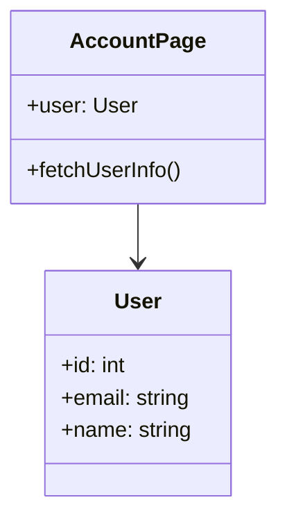

# アカウント関連クラス図（Mermaid）

```mermaid
classDiagram
    class AccountPage {
        +user: User
        +fetchUserInfo()
    }
    class User {
        +id: int
        +email: string
        +name: string
    }
    AccountPage --> User
```
