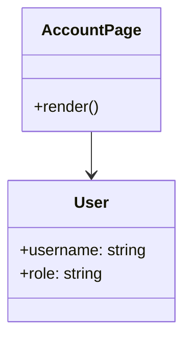

# アカウント関連クラス図（Mermaid）

```mermaid
classDiagram
    class AccountPage {
        +render()
    }

    class User {
        +username: string
        +role: string
    }

    AccountPage --> User
```

AccountPage 自体は `/api/user/me/` を直接叩かず、`ClientLayout` 内の `useAuthCheck` が取得した `first_name` と `role` を store 経由で利用する。
`/api/user/me/` のレスポンスは現在、`first_name` と `role` の最小構成。
