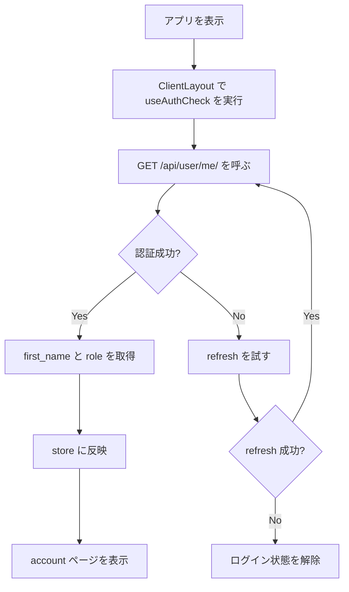

# アカウントページフロー（Mermaid）

```mermaid
flowchart TD
    A[アプリを表示] --> B[ClientLayout で useAuthCheck を実行]
    B --> C[GET /api/user/me/ を呼ぶ]
    C --> D{認証成功?}
    D -->|Yes| E[first_name と role を取得]
    E --> F[store に反映]
    F --> G[account ページを表示]
    D -->|No| H[refresh を試す]
    H --> I{refresh 成功?}
    I -->|Yes| C
    I -->|No| J[ログイン状態を解除]
```
