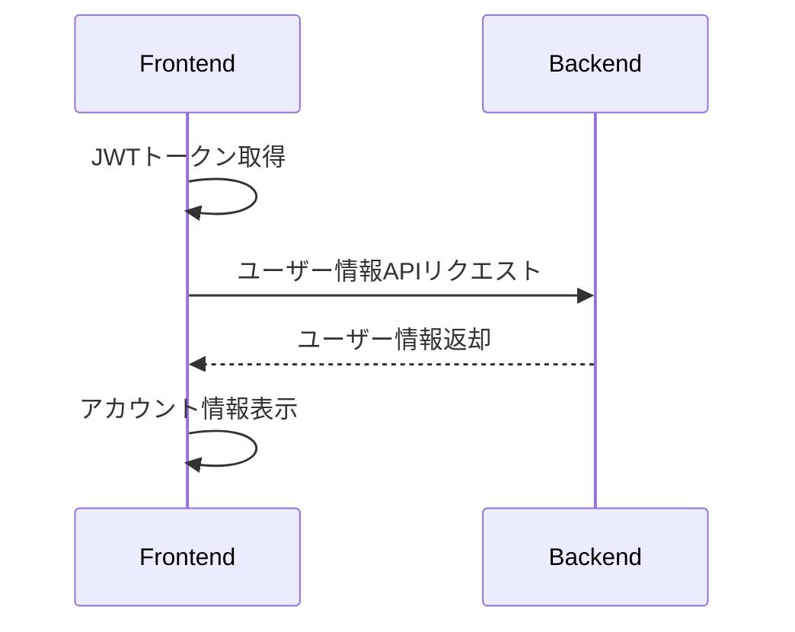

# アカウントページシーケンス図（Mermaid）

```mermaid
sequenceDiagram
    participant F as Frontend
    participant B as Backend
    F->>F: JWTトークン取得
    F->>B: ユーザー情報APIリクエスト
    B-->>F: ユーザー情報返却
    F->>F: アカウント情報表示
```
