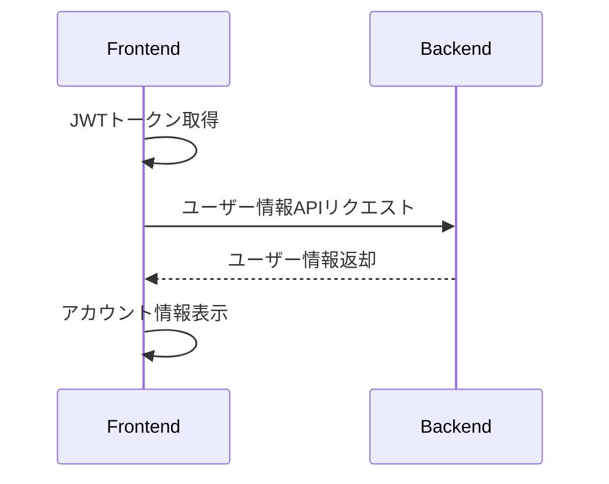
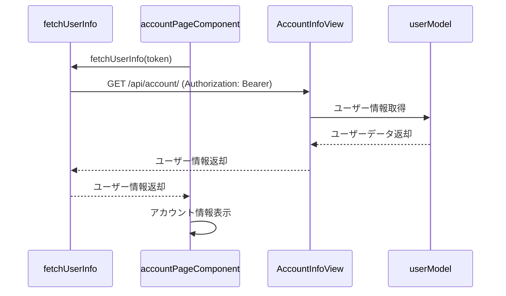

# アカウントページシーケンス図（抽象版）

```mermaid
sequenceDiagram
    participant F as Frontend
    participant B as Backend
    F->>F: JWTトークン取得
    F->>B: ユーザー情報APIリクエスト
    B-->>F: ユーザー情報返却
    F->>F: アカウント情報表示
```

---

# アカウントページシーケンス図（詳細：クラスごと）

```mermaid
sequenceDiagram
    participant fu as fetchUserInfo
    participant ap as accountPageComponent
    participant aiv as AccountInfoView
    participant um as userModel
    ap->>fu: fetchUserInfo(token)
    fu->>aiv: GET /api/account/ (Authorization: Bearer)
    aiv->>um: ユーザー情報取得
    um-->>aiv: ユーザーデータ返却
    aiv-->>fu: ユーザー情報返却
    fu-->>ap: ユーザー情報返却
    ap->>ap: アカウント情報表示
```
