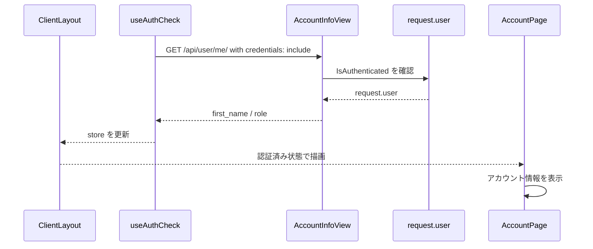
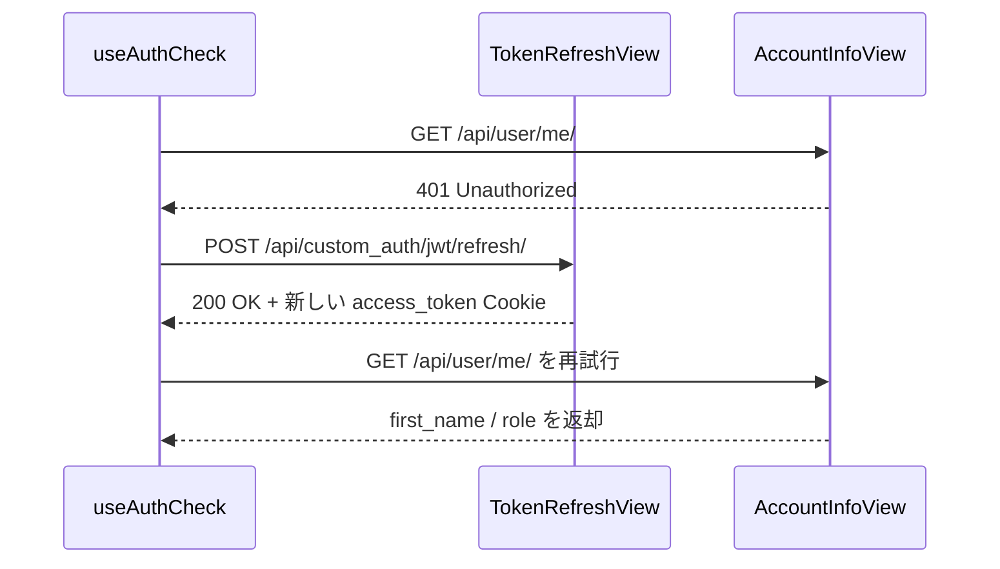

# アカウントページシーケンス図

```mermaid
sequenceDiagram
    participant Layout as ClientLayout
    participant Front as useAuthCheck
    participant View as AccountInfoView
    participant User as request.user
    participant Page as AccountPage

    Front->>View: GET /api/user/me/ with credentials: include
    View->>User: IsAuthenticated を確認
    User-->>View: request.user
    View-->>Front: first_name / role
    Front-->>Layout: store を更新
    Layout-->>Page: 認証済み状態で描画
    Page->>Page: アカウント情報を表示
```

```mermaid
sequenceDiagram
    participant Front as useAuthCheck
    participant Refresh as TokenRefreshView
    participant View as AccountInfoView

    Front->>View: GET /api/user/me/
    View-->>Front: 401 Unauthorized
    Front->>Refresh: POST /api/custom_auth/jwt/refresh/
    Refresh-->>Front: 200 OK + 新しい access_token Cookie
    Front->>View: GET /api/user/me/ を再試行
    View-->>Front: first_name / role を返却
```
