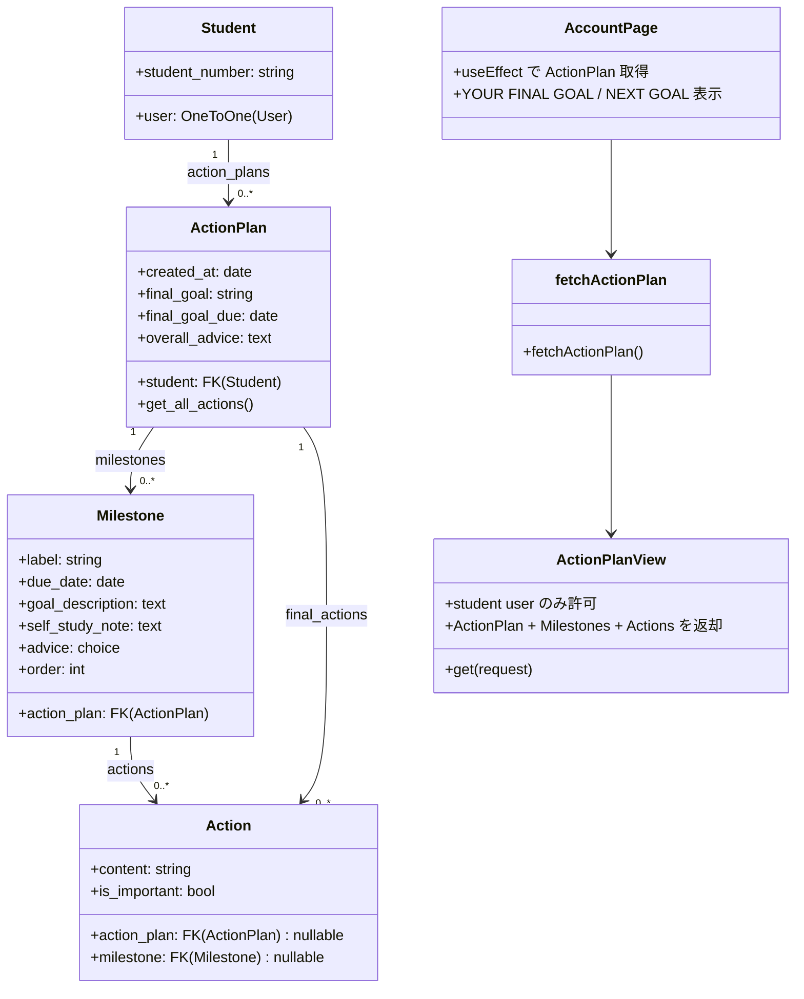

# ActionPlan関連クラス図（Mermaid）

- Action は `action_plan` または `milestone` のどちらか一方のみを持つ（`ck_action_exactly_one_parent`）。
- Milestone の並びは `order` で管理し、同一 ActionPlan 内でユニーク（`uq_milestone_order_per_plan`）。
- Milestone.advice は choices から選択し、APIでは表示文言（`get_advice_display()`）を返す。
