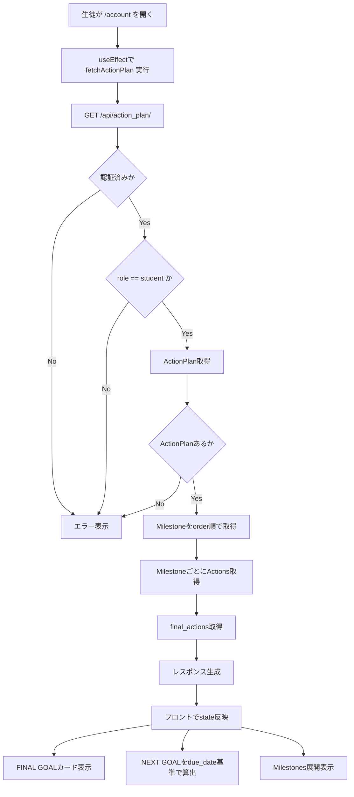

# ActionPlan表示フロー（Mermaid）

```mermaid
flowchart TD
    A[生徒が /account を開く] --> B[useEffectで fetchActionPlan 実行]
    B --> C[GET /api/action_plan/]
    C --> D{認証済みか}
    D -->|No| E[エラー表示]
    D -->|Yes| F{role == student か}
    F -->|No| E
    F -->|Yes| G[ActionPlan取得]
    G --> H{ActionPlanあるか}
    H -->|No| E
    H -->|Yes| I[Milestoneをorder順で取得]
    I --> J[MilestoneごとにActions取得]
    J --> K[final_actions取得]
    K --> L[レスポンス生成]
    L --> M[フロントでstate反映]
    M --> N[FINAL GOALカード表示]
    M --> O[NEXT GOALをdue_date基準で算出]
    M --> P[Milestones展開表示]
```

- NEXT GOAL は `due_date >= 今日` の最初の Milestone を使用（なければ最後の Milestone）。
- 期限当日（`due_date == 今日`）は同じ Milestone を表示する。
