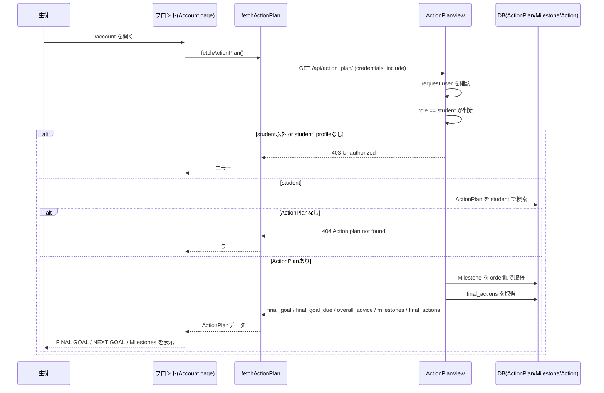

# ActionPlan取得シーケンス図（Mermaid）

```mermaid
sequenceDiagram
    participant User as 生徒
    participant Front as フロント(Account page)
    participant Service as fetchActionPlan
    participant API as ActionPlanView
    participant DB as DB(ActionPlan/Milestone/Action)

    User->>Front: /account を開く
    Front->>Service: fetchActionPlan()
    Service->>API: GET /api/action_plan/ (credentials: include)
    API->>API: request.user を確認
    API->>API: role == student か判定
    alt student以外 or student_profileなし
        API-->>Service: 403 Unauthorized
        Service-->>Front: エラー
    else student
        API->>DB: ActionPlan を student で検索
        alt ActionPlanなし
            API-->>Service: 404 Action plan not found
            Service-->>Front: エラー
        else ActionPlanあり
            API->>DB: Milestone を order順で取得
            API->>DB: final_actions を取得
            API-->>Service: final_goal / final_goal_due / overall_advice / milestones / final_actions
            Service-->>Front: ActionPlanデータ
            Front-->>User: FINAL GOAL / NEXT GOAL / Milestones を表示
        end
    end
```
