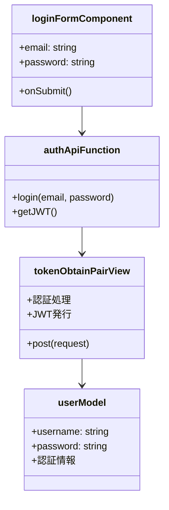

# ログイン関連クラス図（Mermaid）

```mermaid
classDiagram
    class loginFormComponent {
        +email: string
        +password: string
        +onSubmit()
    }
    class authApiFunction {
        +login(email, password)
        +getJWT()
    }
    class tokenObtainPairView {
        +post(request)
        +認証処理
        +JWT発行
    }
    class userModel {
        +username: string
        +password: string
        +認証情報
    }
    loginFormComponent --> authApiFunction
    authApiFunction --> tokenObtainPairView
    tokenObtainPairView --> userModel
    %% loginFormComponent: React関数コンポーネント
    %% authApiFunction: API管理用関数
    %% tokenObtainPairView: Django REST SimpleJWT
    %% userModel: Django認証ユーザーモデル
```
