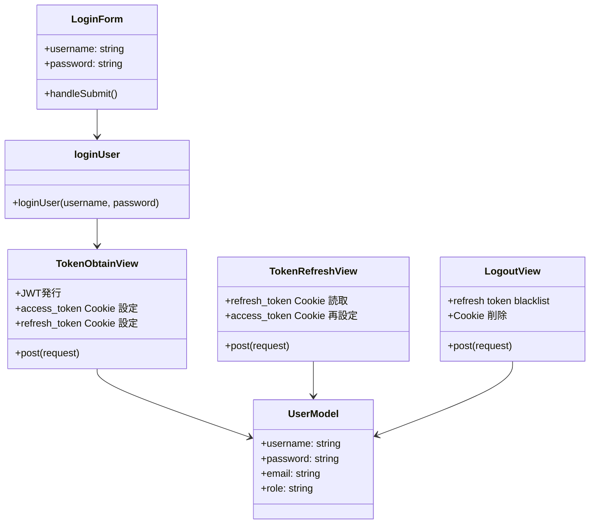

# ログイン関連クラス図（Mermaid）

ログイン時にトークン文字列をフロントで保持することはない。
バックエンドが HttpOnly Cookie に保存し、フロントはログイン状態とユーザー属性（username / role）だけを store に持つ。
student_number / tutor_number はフロントに渡さない。バックエンドは Cookie から request.user を特定し、request.user.student_profile / request.user.tutor_profile でアクセスする。
