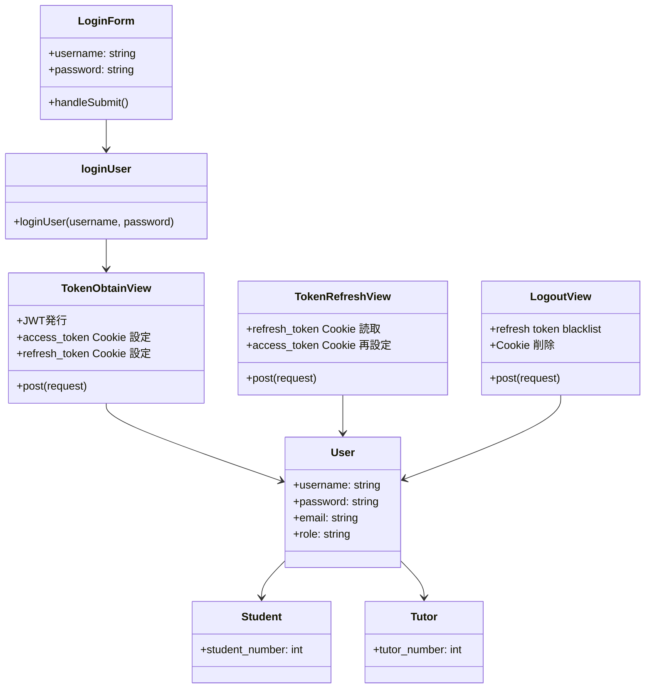

# ログイン関連クラス図（Mermaid）

```mermaid
classDiagram
    class LoginForm {
        +username: string
        +password: string
        +handleSubmit()
    }

    class loginUser {
        +loginUser(username, password)
    }

    class TokenObtainView {
        +post(request)
        +JWT発行
        +access_token Cookie 設定
        +refresh_token Cookie 設定
    }

    class TokenRefreshView {
        +post(request)
        +refresh_token Cookie 読取
        +access_token Cookie 再設定
    }

    class LogoutView {
        +post(request)
        +refresh token blacklist
        +Cookie 削除
    }

    class User {
        +username: string
        +password: string
        +email: string
        +role: string
    }

    class Student {
        +student_number: int
    }

    class Tutor {
        +tutor_number: int
    }

    LoginForm --> loginUser
    loginUser --> TokenObtainView
    TokenObtainView --> User
    TokenRefreshView --> User
    LogoutView --> User
    User --> Student
    User --> Tutor
```

ログイン時にトークン文字列をフロントで保持することはない。
バックエンドが HttpOnly Cookie に保存し、フロントはログイン状態とユーザー属性だけを store に持つ。
