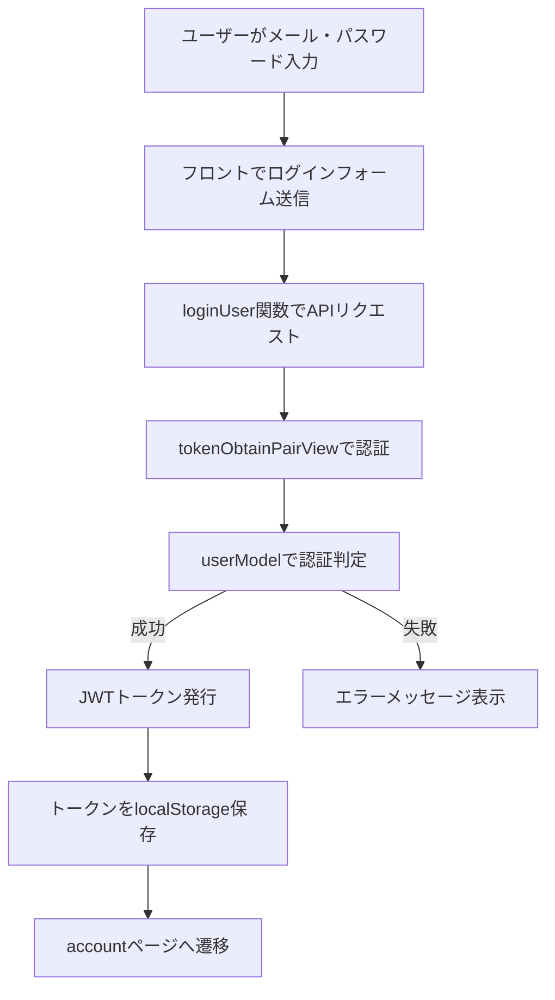

<!-- フローチャート -->

```mermaid
flowchart TD
    a[ユーザーがメール・パスワード入力] --> b[フロントでログインフォーム送信]
    b --> c[loginUser関数でAPIリクエスト]
    c --> d[tokenObtainPairViewで認証]
    d --> e[userModelで認証判定]
    e -->|成功| f[JWTトークン発行]
    f --> g[トークンをlocalStorage保存]
    g --> h[accountページへ遷移]
    e -->|失敗| i[エラーメッセージ表示]
```