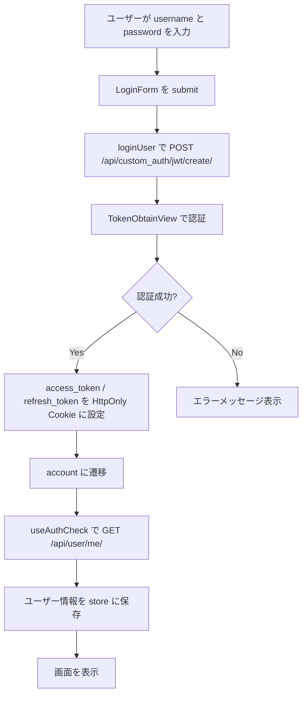
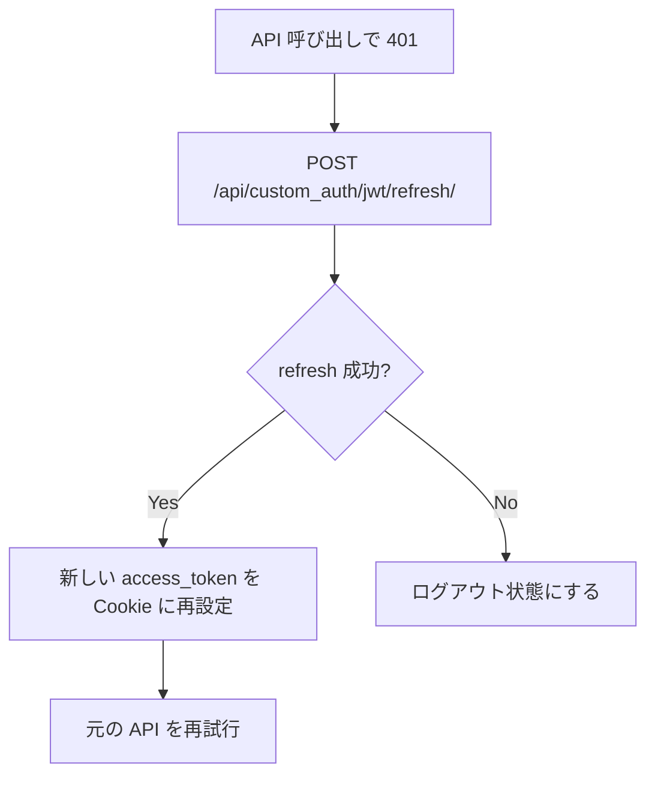

# ログインフローチャート

```mermaid
flowchart TD
    A[ユーザーが username と password を入力] --> B[LoginForm を submit]
    B --> C[loginUser で POST /api/custom_auth/jwt/create/]
    C --> D[TokenObtainView で認証]
    D --> E{認証成功?}
    E -->|Yes| F[access_token / refresh_token を HttpOnly Cookie に設定]
    F --> G[account に遷移]
    G --> H[useAuthCheck で GET /api/user/me/]
    H --> I[ユーザー情報を store に保存]
    I --> J[画面を表示]
    E -->|No| K[エラーメッセージ表示]
```

```mermaid
flowchart TD
    L[API 呼び出しで 401] --> M[POST /api/custom_auth/jwt/refresh/]
    M --> N{refresh 成功?}
    N -->|Yes| O[新しい access_token を Cookie に再設定]
    O --> P[元の API を再試行]
    N -->|No| Q[ログアウト状態にする]
```