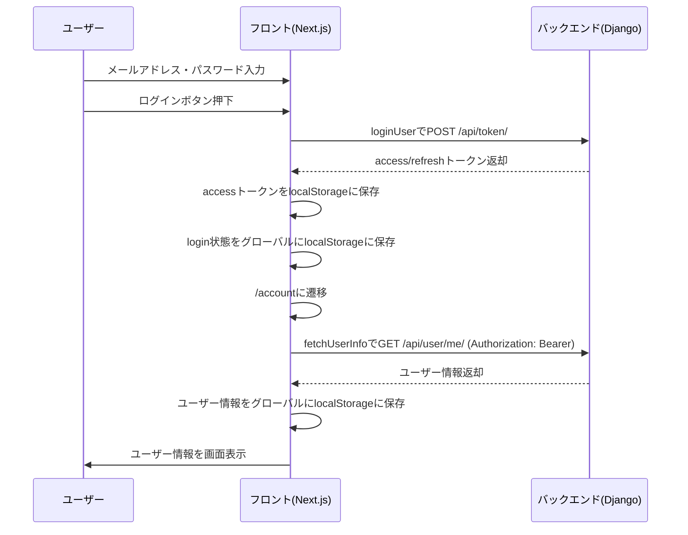

sequenceDiagram

```mermaid
sequenceDiagram
    participant user as ユーザー
    participant front as フロント(Next.js)
    participant back as バックエンド(Django)

    user->>front: メールアドレス・パスワード入力
    user->>front: ログインボタン押下
    front->>back: loginUserでPOST /api/token/
    back-->>front: access/refreshトークン返却
    front->>front: accessトークンをlocalStorageに保存
    front->>front: login状態をグローバルにlocalStorageに保存
    front->>front: /accountに遷移
    front->>back: fetchUserInfoでGET /api/user/me/ (Authorization: Bearer)
    back-->>front: ユーザー情報返却
    front->>front: ユーザー情報をグローバルにlocalStorageに保存
    front->>user: ユーザー情報を画面表示
```
