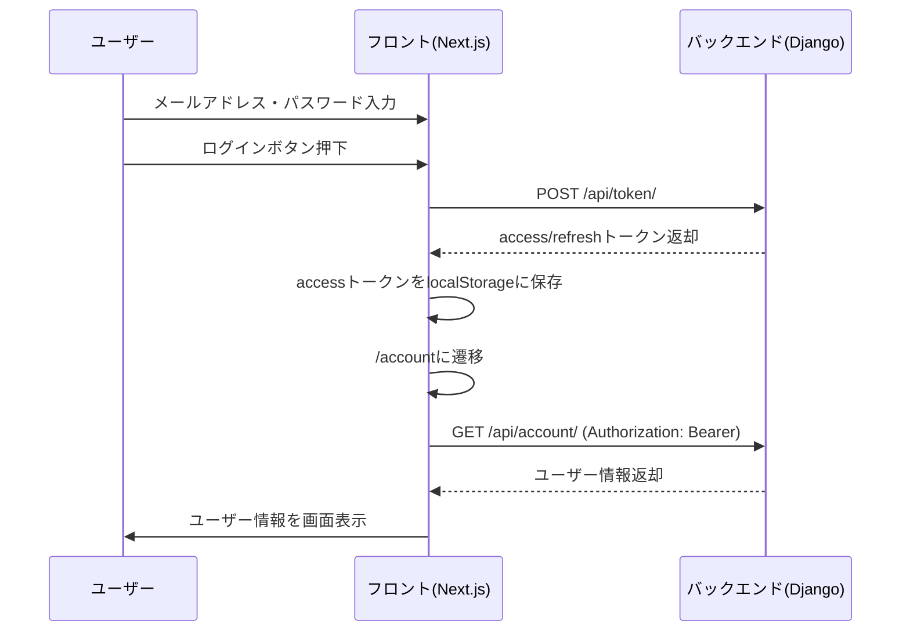
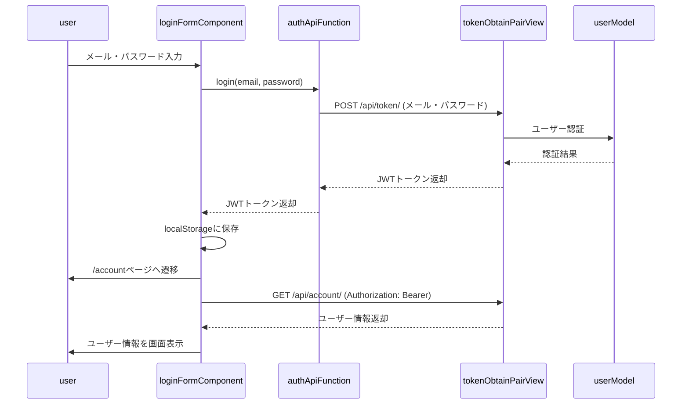

sequenceDiagram

```mermaid
sequenceDiagram
    participant user as ユーザー
    participant front as フロント(Next.js)
    participant back as バックエンド(Django)

    user->>front: メールアドレス・パスワード入力
    user->>front: ログインボタン押下
    front->>back: POST /api/token/
    back-->>front: access/refreshトークン返却
    front->>front: accessトークンをlocalStorageに保存
    front->>front: /accountに遷移
    front->>back: GET /api/account/ (Authorization: Bearer)
    back-->>front: ユーザー情報返却
    front->>user: ユーザー情報を画面表示
```

---

# ログインシーケンス図（詳細：クラスごと）

```mermaid
sequenceDiagram
    participant user as user
    participant lfc as loginFormComponent
    participant aaf as authApiFunction
    participant tov as tokenObtainPairView
    participant um as userModel
    user->>lfc: メール・パスワード入力
    lfc->>aaf: login(email, password)
    aaf->>tov: POST /api/token/ (メール・パスワード)
    tov->>um: ユーザー認証
    um-->>tov: 認証結果
    tov-->>aaf: JWTトークン返却
    aaf-->>lfc: JWTトークン返却
    lfc->>lfc: localStorageに保存
    lfc->>user: /accountページへ遷移
    lfc->>tov: GET /api/account/ (Authorization: Bearer)
    tov-->>lfc: ユーザー情報返却
    lfc->>user: ユーザー情報を画面表示
```