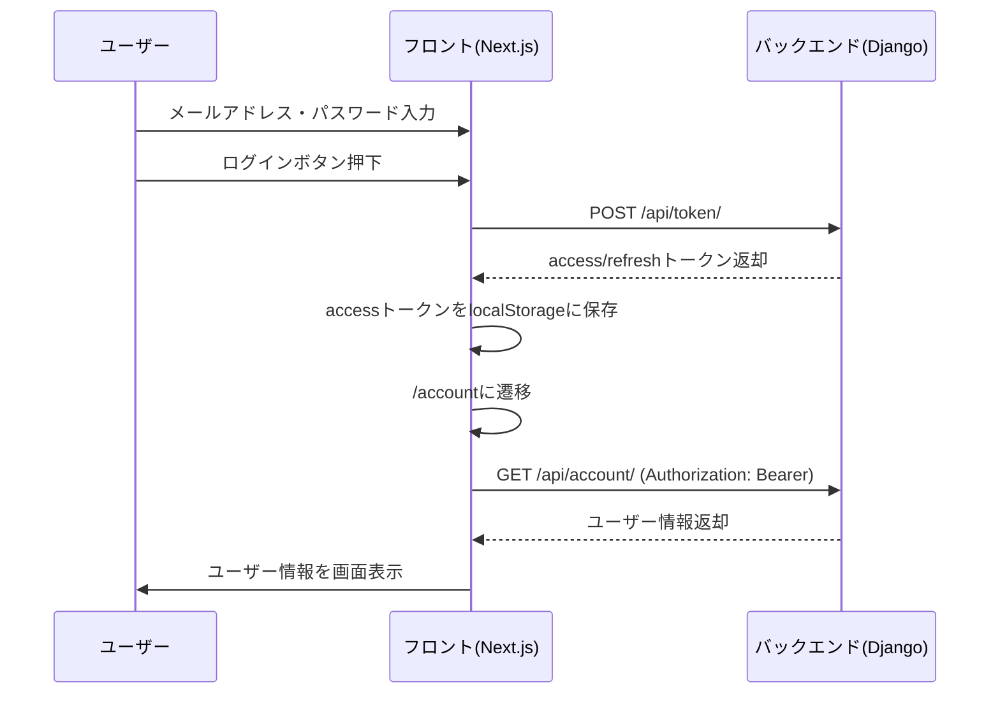

sequenceDiagram

```mermaid
sequenceDiagram
    participant User as ユーザー
    participant Front as フロント(Next.js)
    participant Back as バックエンド(Django)

    User->>Front: メールアドレス・パスワード入力
    User->>Front: ログインボタン押下
    Front->>Back: POST /api/token/
    Back-->>Front: access/refreshトークン返却
    Front->>Front: accessトークンをlocalStorageに保存
    Front->>Front: /accountに遷移
    Front->>Back: GET /api/account/ (Authorization: Bearer)
    Back-->>Front: ユーザー情報返却
    Front->>User: ユーザー情報を画面表示
```