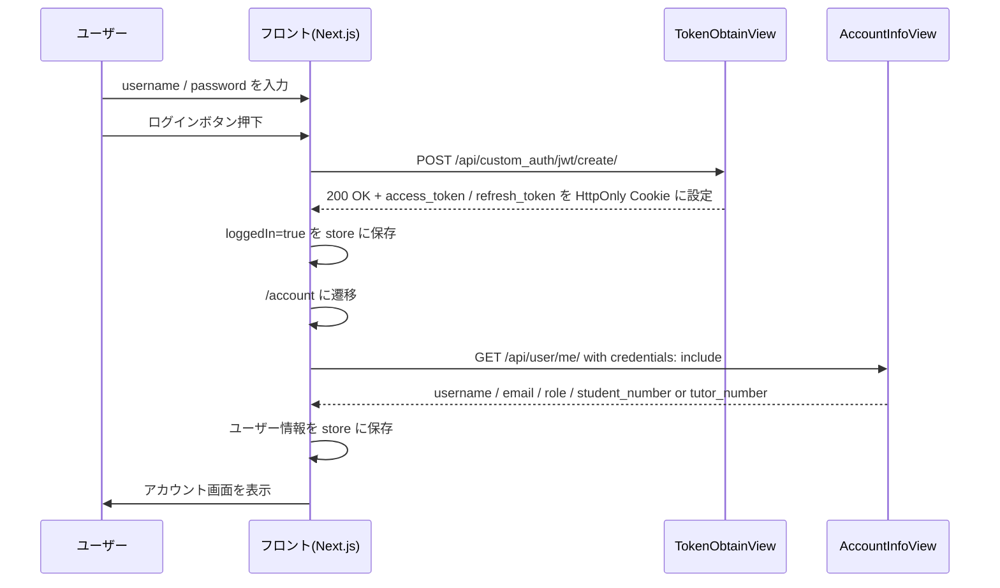
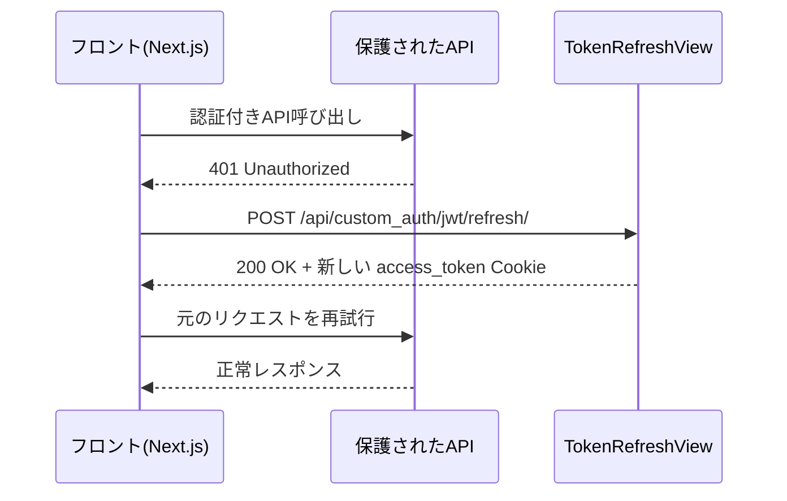

```mermaid
sequenceDiagram
    participant User as ユーザー
    participant Front as フロント(Next.js)
    participant Auth as TokenObtainView
    participant Account as AccountInfoView

    User->>Front: username / password を入力
    User->>Front: ログインボタン押下
    Front->>Auth: POST /api/custom_auth/jwt/create/
    Auth-->>Front: 200 OK + access_token / refresh_token を HttpOnly Cookie に設定
    Front->>Front: loggedIn=true を store に保存
    Front->>Front: /account に遷移
    Front->>Account: GET /api/user/me/ with credentials: include
    Account-->>Front: username / email / role / student_number or tutor_number
    Front->>Front: ユーザー情報を store に保存
    Front->>User: アカウント画面を表示
```

```mermaid
sequenceDiagram
    participant Front as フロント(Next.js)
    participant Api as 保護されたAPI
    participant Refresh as TokenRefreshView

    Front->>Api: 認証付きAPI呼び出し
    Api-->>Front: 401 Unauthorized
    Front->>Refresh: POST /api/custom_auth/jwt/refresh/
    Refresh-->>Front: 200 OK + 新しい access_token Cookie
    Front->>Api: 元のリクエストを再試行
    Api-->>Front: 正常レスポンス
```
