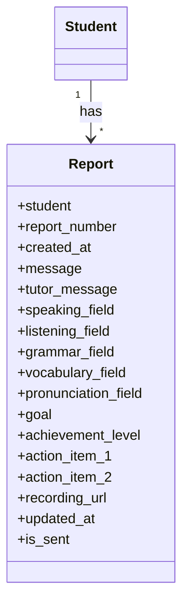

# Trajectoryアプリ クラス設計

## Reportモデル
- student: 生徒（FK → Student）
- report_number: レポート回数（1回目、2回目...）
- created_at: 作成日
- message: コーチからのメッセージ
- tutor_message: チューターからのメッセージ
- speaking_field, listening_field, grammar_field, vocabulary_field, pronunciation_field: スキル別コメント
- goal: 次回の目標
- achievement_level: 前回目標の達成度（未着手/途中/達成）
- action_item_1, action_item_2: 目標達成のためのアクション
- recording_url: レコーディングURL
- updated_at: 更新日
- is_sent: 生徒に送信済み

## 主な操作
- 生徒ごとのレポート一覧取得
- 最新レポート取得
- レポート新規作成・更新
- レポート送信

---

## クラス図（UML）

