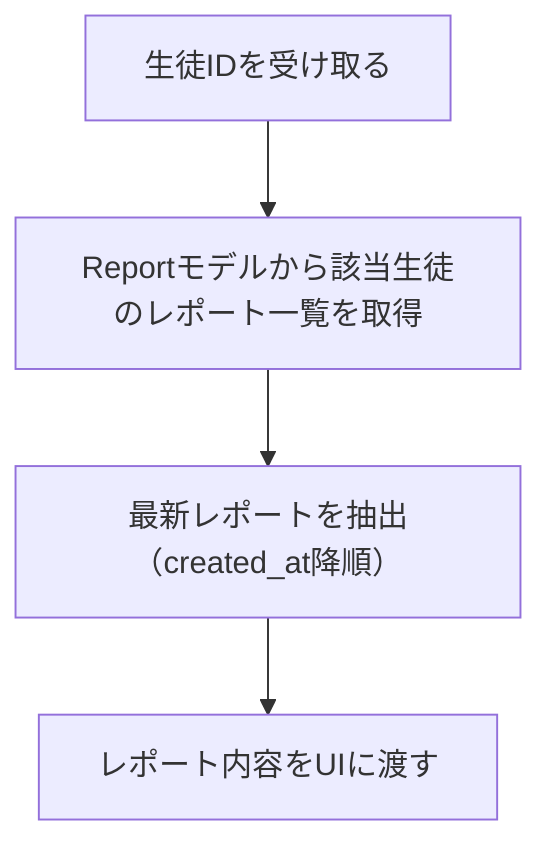
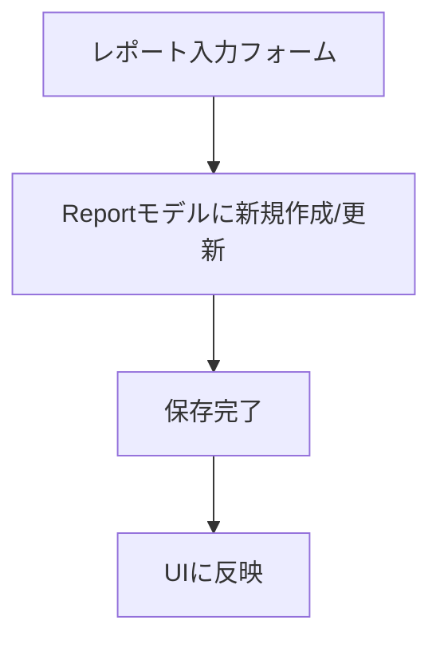

# Trajectoryアプリ フローチャート

## Report情報取得フロー

```mermaid
flowchart TD
    A[生徒IDを受け取る] --> B[Reportモデルから該当生徒のレポート一覧を取得]
    B --> C[最新レポートを抽出（created_at降順）]
    C --> D[レポート内容をUIに渡す]
```

## レポート新規作成・更新フロー

```mermaid
flowchart TD
    E[レポート入力フォーム] --> F[Reportモデルに新規作成/更新]
    F --> G[保存完了]
    G --> H[UIに反映]
```
