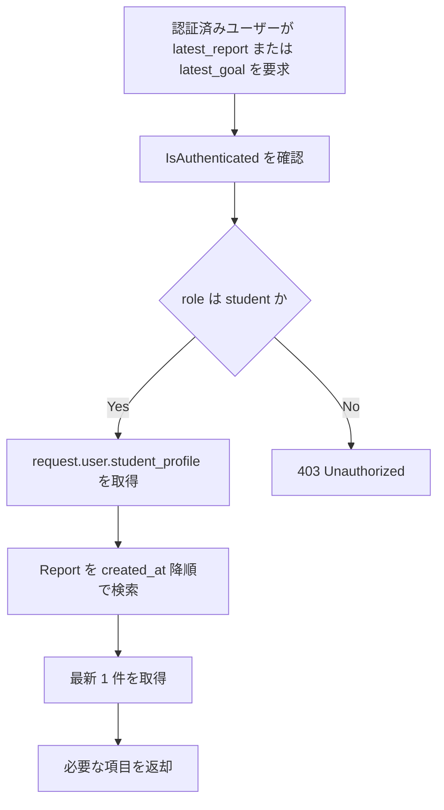

# Trajectoryアプリ フローチャート

## Report情報取得フロー

```mermaid
flowchart TD
    A[認証済みユーザーが latest_report または latest_goal を要求] --> B[IsAuthenticated を確認]
    B --> C{role は student か}
    C -->|Yes| D[request.user.student_profile を取得]
    D --> E[Report を created_at 降順で検索]
    E --> F[最新 1 件を取得]
    F --> G[必要な項目を返却]
    C -->|No| H[403 Unauthorized]
```
