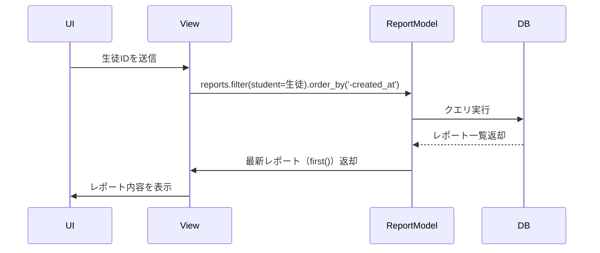
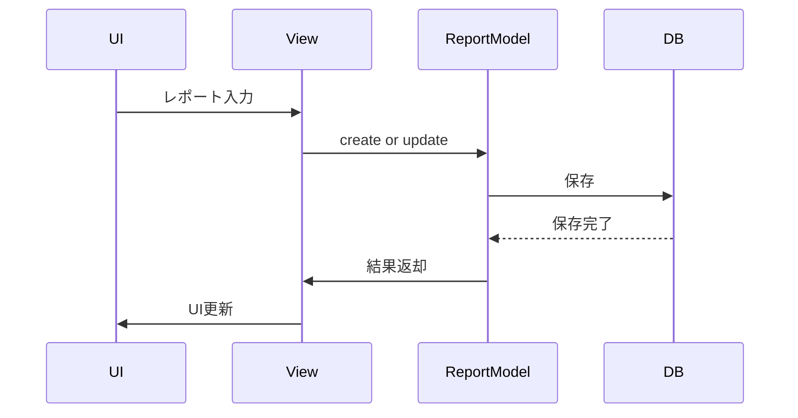

# Trajectoryアプリ シーケンス図

## 最新レポート取得シーケンス

```mermaid
sequenceDiagram
    participant UI
    participant View
    participant ReportModel
    participant DB

    UI->>View: 生徒IDを送信
    View->>ReportModel: reports.filter(student=生徒).order_by('-created_at')
    ReportModel->>DB: クエリ実行
    DB-->>ReportModel: レポート一覧返却
    ReportModel->>View: 最新レポート（first()）返却
    View->>UI: レポート内容を表示
```

## レポート新規作成シーケンス

```mermaid
sequenceDiagram
    participant UI
    participant View
    participant ReportModel
    participant DB

    UI->>View: レポート入力
    View->>ReportModel: create or update
    ReportModel->>DB: 保存
    DB-->>ReportModel: 保存完了
    ReportModel->>View: 結果返却
    View->>UI: UI更新
```
