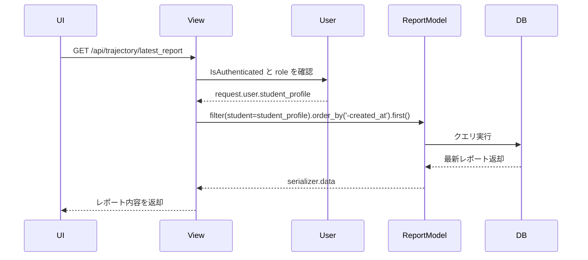

# Trajectoryアプリ シーケンス図

## 最新レポート取得シーケンス

```mermaid
sequenceDiagram
    participant UI
    participant View
    participant User
    participant ReportModel
    participant DB

    UI->>View: GET /api/trajectory/latest_report
    View->>User: IsAuthenticated と role を確認
    User-->>View: request.user.student_profile
    View->>ReportModel: filter(student=student_profile).order_by('-created_at').first()
    ReportModel->>DB: クエリ実行
    DB-->>ReportModel: 最新レポート返却
    ReportModel-->>View: serializer.data
    View-->>UI: レポート内容を返却
```
